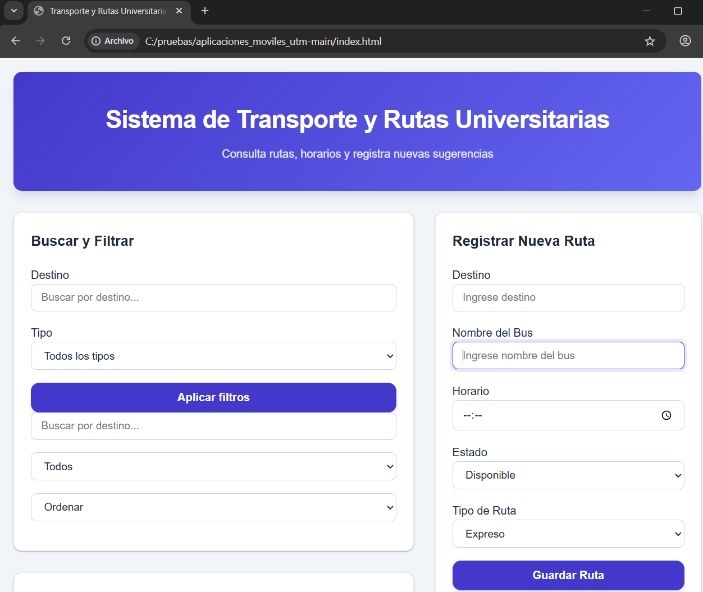
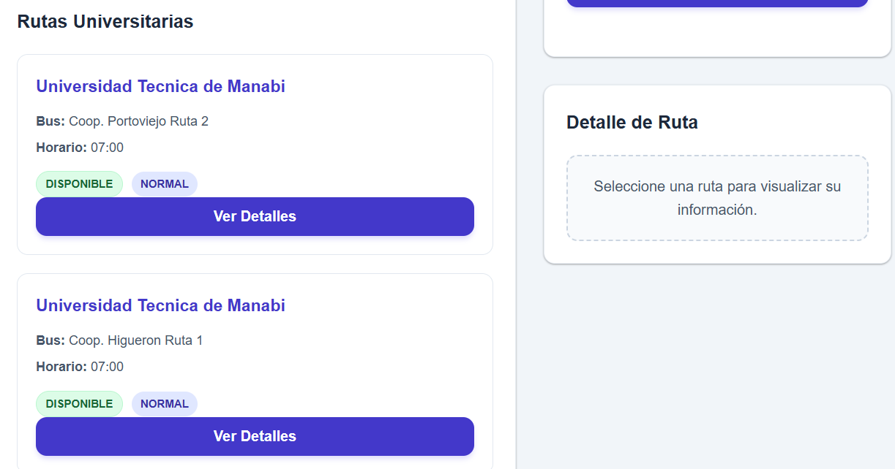
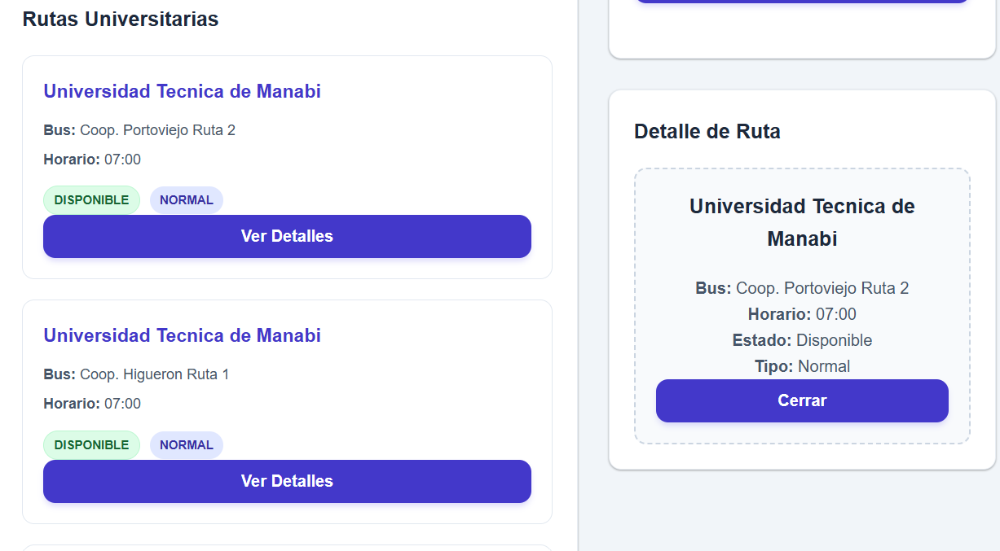

# Sistema de Transporte y Rutas Universitarias del grupo 7 

## Descripción

Este proyecto consiste en un dashboard web interactivo desarrollado con HTML, CSS y JavaScript para la gestión de rutas universitarias

El sistema permite visualizar rutas, horarios y estados de buses, además de registrar nuevas rutas y aplicar filtros de búsqueda para ver informacion relevante

---

## Funcionalidades

- Mostrar rutas universitarias dinámicamente
- Buscar rutas por destino
- Filtrar rutas por tipo
- Ordenar rutas por horario
- Registrar nuevas rutas
- Validar formularios
- Mostrar detalles de una ruta
- Persistencia de datos mediante localStorage

---

## Tecnologías utilizadas

- HTML5
- CSS3
- JavaScript ES6

---

## Métodos de JavaScript utilizados

- map()
- filter()
- find()
- sort()

---

## Estructura del proyecto de rutas_universitarias

```txt
/index.html
/styles.css
/js
   ├── app.js
   ├── data.js
   ├── filtros.js
   ├── formulario.js
   ├── render.js
   └── storage.js
```

---

## Cómo ejecutar el proyecto

1. Descargar el proyecto
2. Abrir la carpeta del proyecto
3. Ejecutar el archivo `index.html` en el navegador

---

## Funciones principales

### Búsqueda y filtros
Permite buscar rutas por destino y filtrar por tipo de ruta

### Registro de rutas
Permite agregar nuevas rutas mediante un formulario con validaciones

### Persistencia local
Las rutas se guardan utilizando localStorage para mantener la información después de recargar la página

---

## Capturas de funcionamiento del sistema

## Registro de rutas

[](evidencias/registro.png)

---

## Información de las rutas ingresadas

[](evidencias/informacion.png)

---

## Detalles de una ruta seleccionada

[](evidencias/informacion_de_rutas.png)
---

## Autores

Proyecto académico - JavaScript Intermedio
Grupo 7
CARLOS STEVEN AUCANCELA FERNANDEZ
JAME JAVIER INAGAN LEONES
MARIA JOSE INTRIAGO PONCE
GENESSIS LORELY NAVARRO CALDERON
ELIO GABRIEL VERA JAMA 
